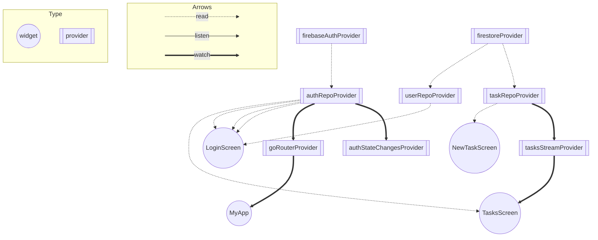

# riverpod_training
FireStoreを用いてタスク追加をするだけのサンプルです。
研修で使用します。

# 構成
<pre>
lib
├── config
│   ├── firebase
│   │   ├── firebase_auth_error_text.dart
│   │   ├── firebase_options.dart
│   │   ├── firebase_provider.dart
│   │   └── firebase_provider.g.dart
│   └── utils
│       ├── enum
│       │   └── router_enum.dart
│       └── keys
│           └── firebase_key.dart
├── data_models
│   ├── account
│   │   ├── account.dart
│   │   ├── account.freezed.dart
│   │   └── account.g.dart
│   ├── task
│   │   ├── task.dart
│   │   ├── task.freezed.dart
│   │   └── task.g.dart
│   └── timestamp_converter.dart
├── main.dart
├── repo
│   ├── auth
│   │   ├── auth_repository.dart
│   │   └── auth_repository.g.dart
│   ├── tasks
│   │   ├── tasks_repository.dart
│   │   └── tasks_repository.g.dart
│   └── user
│       ├── user_repository.dart
│       └── user_repository.g.dart
├── routing
│   ├── app_router.dart
│   ├── app_router.g.dart
│   └── go_router_refresh_stream.dart
└── view
    ├── login_screen.dart
    ├── new_task_page.dart
    └── tasks_page.dart
</pre>

# Provider graph

Generated by https://github.com/rrousselGit/riverpod/tree/master/packages/riverpod_graph

