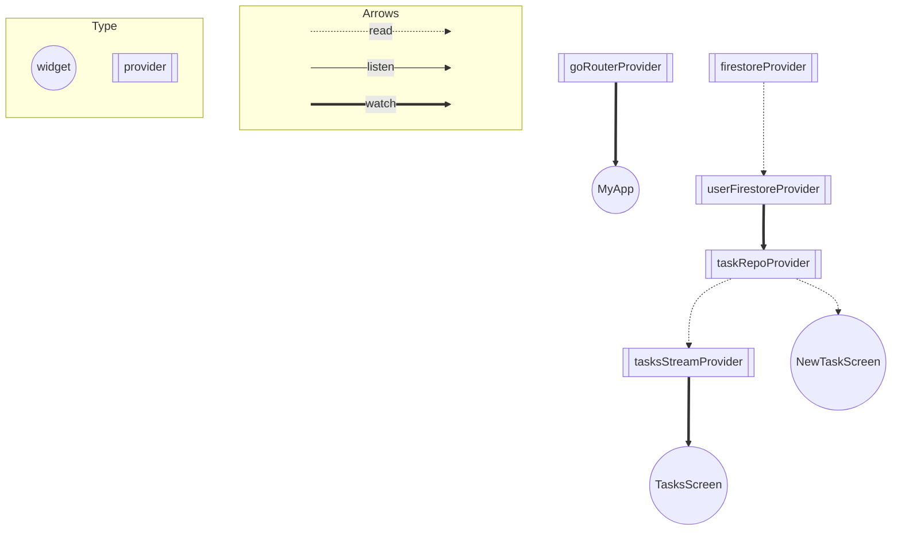

# riverpod_training
FireStoreを用いてタスク追加をするだけのサンプルです。
研修で使用します。

# 構成
<pre>
.
├── lib
│   ├── config(設定周り)
│   │   ├── firebase(firebase関連の設定)
│   │   │   ├── firebase_options.dart
│   │   │   ├── firebase_provider.dart
│   │   │   └── firebase_provider.g.dart
│   │   └── utils(色やkey、enumなど)
│   │       ├── enum
│   │       │   └── router_enum.dart
│   │       └── keys
│   │           └── firebase_key.dart
│   ├── data_models(データモデル)
│   │   ├── task
│   │   │   ├── task.dart
│   │   │   ├── task.freezed.dart
│   │   │   └── task.g.dart
│   │   └── timestamp_converter.dart
│   ├── main.dart
│   ├── repo（firestore利用箇所）
│   │   ├── tasks_repository.dart
│   │   └── tasks_repository.g.dart
│   ├── routing(go_router定義)
│   │   ├── app_router.dart
│   │   └── app_router.g.dart
│   └── view(UI部分)
│       ├── new_task_page.dart
│       └── tasks_page.dart
├── pubspec.lock
├── pubspec.yaml
└── web
    ├── favicon.png
    ├── icons
    │   ├── Icon-192.png
    │   ├── Icon-512.png
    │   ├── Icon-maskable-192.png
    │   └── Icon-maskable-512.png
    ├── index.html
    └── manifest.json
</pre>

# Provider graph

Generated by https://github.com/rrousselGit/riverpod/tree/master/packages/riverpod_graph

