# riverpod_training
FireStoreを用いてタスク追加をするだけのサンプルです。
研修で使用します。

# 構成
<pre>
lib
├── common_widgets
│   └── task_list_tile.dart
├── config
│   ├── firebase
│   │   ├── firebase_auth_error_text.dart
│   │   ├── firebase_instance_provider.dart
│   │   ├── firebase_instance_provider.g.dart
│   │   └── firebase_options.dart
│   └── utils
│       ├── enum
│       │   └── router_enum.dart
│       ├── fontStyle
│       │   └── font_size.dart
│       ├── keys
│       │   └── firebase_key.dart
│       └── margin
│           ├── height_margin.dart
│           └── width_margin.dart
├── features
│   ├── auth
│   │   ├── controller
│   │   │   ├── auth_controller.dart
│   │   │   ├── auth_controller.g.dart
│   │   │   ├── current_user_controller.dart
│   │   │   └── current_user_controller.g.dart
│   │   ├── repo
│   │   │   ├── auth_repo.dart
│   │   │   └── auth_repo.g.dart
│   │   └── view
│   │       └── auth_page.dart
│   ├── like
│   │   ├── controller
│   │   │   ├── like_controller.dart
│   │   │   └── like_controller.g.dart
│   │   ├── data_model
│   │   │   ├── like.dart
│   │   │   ├── like.freezed.dart
│   │   │   └── like.g.dart
│   │   └── repo
│   │       ├── like_repo.dart
│   │       └── like_repo.g.dart
│   ├── navigation
│   │   └── view
│   │       └── bottom_navigation_page.dart
│   ├── task
│   │   ├── controller
│   │   │   ├── task_controller.dart
│   │   │   └── task_controller.g.dart
│   │   ├── data_model
│   │   │   ├── task.dart
│   │   │   ├── task.freezed.dart
│   │   │   └── task.g.dart
│   │   ├── repo
│   │   │   ├── task_repo.dart
│   │   │   └── task_repo.g.dart
│   │   └── view
│   │       ├── add_or_edit_task_page.dart
│   │       └── tasks_page.dart
│   └── user
│       ├── controller
│       │   ├── storage_controller.dart
│       │   ├── storage_controller.g.dart
│       │   ├── user_controller.dart
│       │   └── user_controller.g.dart
│       ├── data_model
│       │   ├── user_data.dart
│       │   ├── user_data.freezed.dart
│       │   └── user_data.g.dart
│       ├── repo
│       │   ├── storage_repo.dart
│       │   ├── storage_repo.g.dart
│       │   ├── user_repo.dart
│       │   └── user_repo.g.dart
│       └── view
│           ├── edit_my_image_page.dart
│           ├── edit_my_user_page.dart
│           ├── my_page.dart
│           └── users_page.dart
├── functions
│   ├── show_snack_bar.dart
│   └── timestamp_converter.dart
├── main.dart
└── routing
    ├── app_router.dart
    ├── app_router.g.dart
    ├── go_router_refresh_stream.dart
    └── go_router_refresh_stream.dart
</pre>

# Provider graph

Generated by https://github.com/rrousselGit/riverpod/tree/master/packages/riverpod_graph

```mermaid
flowchart TB
  subgraph Arrows
    direction LR
    start1[ ] -..->|read| stop1[ ]
    style start1 height:0px;
    style stop1 height:0px;
    start2[ ] --->|listen| stop2[ ]
    style start2 height:0px;
    style stop2 height:0px; 
    start3[ ] ===>|watch| stop3[ ]
    style start3 height:0px;
    style stop3 height:0px; 
  end

  subgraph Type
    direction TB
    ConsumerWidget((widget));
    Provider[[provider]];
  end
  AuthPage((AuthPage));
  authControllerProvider -.-> AuthPage;
  authControllerProvider -.-> AuthPage;
  userControllerProvider -.-> AuthPage;
  BottomNavigationPage((BottomNavigationPage));
  goRouterProvider ==> BottomNavigationPage;
  goRouterProvider -.-> BottomNavigationPage;
  EditMyUserPage((EditMyUserPage));
  watchMyAccountControllerProvider ==> EditMyUserPage;
  userControllerProvider ==> EditMyUserPage;
  userControllerProvider -.-> EditMyUserPage;
  EditMyImagePage((EditMyImagePage));
  watchMyAccountControllerProvider ==> EditMyImagePage;
  storageControllerProvider ==> EditMyImagePage;
  storageControllerProvider -.-> EditMyImagePage;
  storageControllerProvider -.-> EditMyImagePage;
  userControllerProvider -.-> EditMyImagePage;
  userControllerProvider -.-> EditMyImagePage;
  UsersPage((UsersPage));
  watchUsersControllerProvider ==> UsersPage;
  MyPage((MyPage));
  watchMyAccountControllerProvider ==> MyPage;
  watchMyTasksControllerProvider ==> MyPage;
  watchMyLikesControllerProvider ==> MyPage;
  watchTaskControllerProvider ==> MyPage;
  authControllerProvider -.-> MyPage;
  authControllerProvider -.-> MyPage;
  currentUserControllerProvider -.-> MyPage;
  authControllerProvider -.-> MyPage;
  authControllerProvider -.-> MyPage;
  TasksScreen((TasksScreen));
  watchMyTasksControllerProvider ==> TasksScreen;
  watchMyTasksControllerProvider ==> TasksScreen;
  tasksStreamControllerProvider ==> TasksScreen;
  taskListProvider ==> TasksScreen;
  taskListProvider -.-> TasksScreen;
  AddOrEditTaskPage((AddOrEditTaskPage));
  getTaskControllerProvider ==> AddOrEditTaskPage;
  taskControllerProvider -.-> AddOrEditTaskPage;
  taskControllerProvider -.-> AddOrEditTaskPage;
  MyApp((MyApp));
  goRouterProvider ==> MyApp;
  TaskListTile((TaskListTile));
  watchAccountControllerProvider ==> TaskListTile;
  watchLikesControllerProvider ==> TaskListTile;
  likeControllerProvider -.-> TaskListTile;
  likeControllerProvider -.-> TaskListTile;
  likeControllerProvider -.-> TaskListTile;
  likeControllerProvider -.-> TaskListTile;
  taskControllerProvider -.-> TaskListTile;
  watchLikesControllerProvider[[watchLikesControllerProvider]];
  likeRepoProvider -.-> watchLikesControllerProvider;
  likeRepoProvider[[likeRepoProvider]];
  firebaseFireStoreInstanceProvider -.-> likeRepoProvider;
  watchMyLikesControllerProvider[[watchMyLikesControllerProvider]];
  firebaseFireStoreInstanceProvider -.-> watchMyLikesControllerProvider;
  authRepoProvider -.-> watchMyLikesControllerProvider;
  firebaseFireStoreInstanceProvider[[firebaseFireStoreInstanceProvider]];
  authRepoProvider[[authRepoProvider]];
  firebaseAuthInstanceProvider ==> authRepoProvider;
  currentUserControllerProvider[[currentUserControllerProvider]];
  authRepoProvider ==> currentUserControllerProvider;
  authControllerProvider[[authControllerProvider]];
  userControllerProvider[[userControllerProvider]];
  firebaseAuthInstanceProvider[[firebaseAuthInstanceProvider]];
  goRouterProvider[[goRouterProvider]];
  authRepoProvider ==> goRouterProvider;
  authRepoProvider -.-> goRouterProvider;
  watchUsersControllerProvider[[watchUsersControllerProvider]];
  userRepoProvider ==> watchUsersControllerProvider;
  userRepoProvider[[userRepoProvider]];
  firebaseFireStoreInstanceProvider -.-> userRepoProvider;
  watchAccountControllerProvider[[watchAccountControllerProvider]];
  userRepoProvider ==> watchAccountControllerProvider;
  watchMyAccountControllerProvider[[watchMyAccountControllerProvider]];
  userRepoProvider ==> watchMyAccountControllerProvider;
  authRepoProvider ==> watchMyAccountControllerProvider;
  storageControllerProvider[[storageControllerProvider]];
  watchMyTasksControllerProvider[[watchMyTasksControllerProvider]];
  taskRepoProvider -.-> watchMyTasksControllerProvider;
  watchTaskControllerProvider[[watchTaskControllerProvider]];
  taskRepoProvider -.-> watchTaskControllerProvider;
  storageRepoProvider[[storageRepoProvider]];
  firebaseStorageInstanceProvider -.-> storageRepoProvider;
  firebaseStorageInstanceProvider[[firebaseStorageInstanceProvider]];
  getTaskControllerProvider[[getTaskControllerProvider]];
  taskRepoProvider -.-> getTaskControllerProvider;
  taskRepoProvider[[taskRepoProvider]];
  firebaseFireStoreInstanceProvider -.-> taskRepoProvider;
  tasksStreamControllerProvider[[tasksStreamControllerProvider]];
  taskRepoProvider -.-> tasksStreamControllerProvider;
  taskListProvider[[taskListProvider]];
  taskRepoProvider -.-> taskListProvider;
  taskControllerProvider[[taskControllerProvider]];
  likeControllerProvider[[likeControllerProvider]];
```

